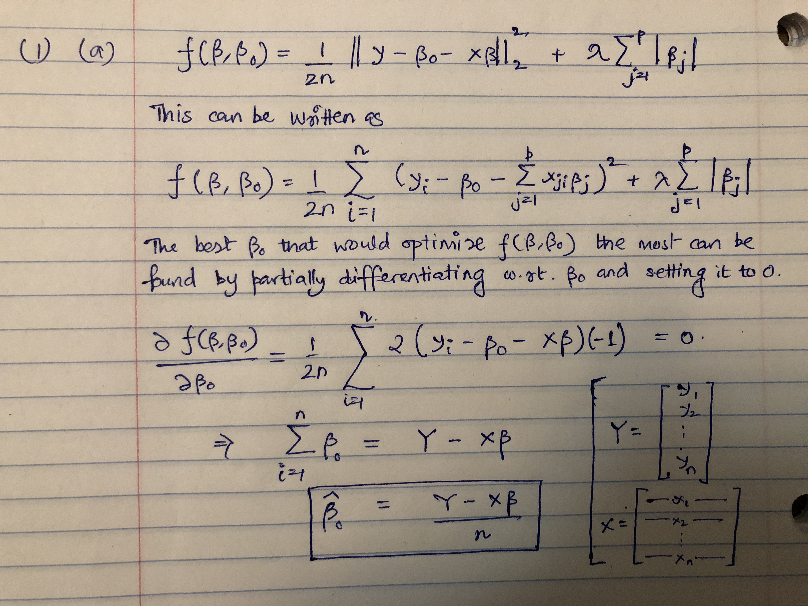
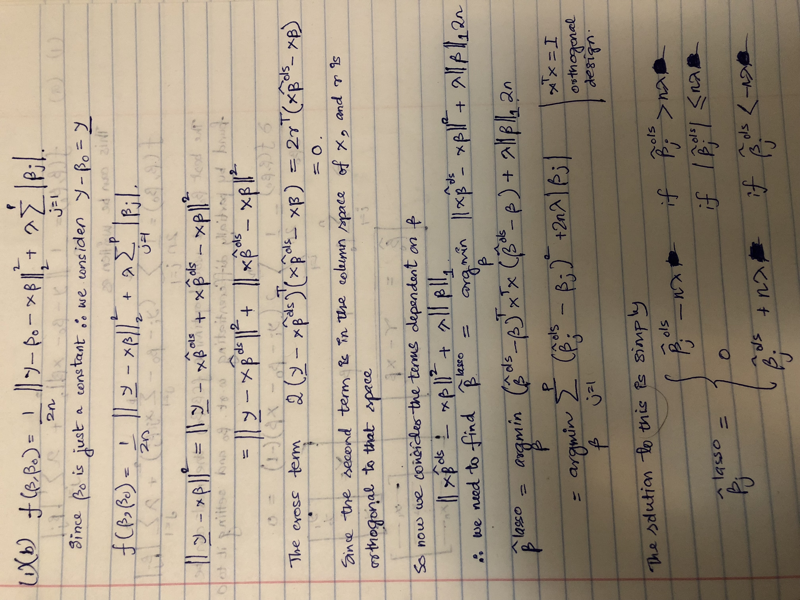

```{r setup, include=FALSE}
knitr::opts_chunk$set(echo = TRUE)
```

# Question 1

```{r message=FALSE, warning=FALSE, include=FALSE}
library(MASS)
library(glmnet)
library(ggplot2)
```

**(a)**

```{r echo=FALSE, message=FALSE, warning=FALSE, paged.print=FALSE}

```

**The one-variable optimization problem of Beta_0 based on this objective function.**

**(b)**

```{r echo=FALSE, message=FALSE, warning=FALSE, paged.print=FALSE}

```

**The one-variable optimization problem of Beta_j based on this objective function.**

For parts (c) and (d) we need to first implement lasso. Following is the implementation in R of lasso

```{r LassoImplementation, echo=TRUE, message=FALSE, warning=FALSE, paged.print=FALSE}
# now start to write functions to fit the lasso
# prepare the soft thresholding function for updating beta_j (part b)
soft_th <- function(b, lambda)
{
  if(b < 0 & abs(b) > lambda)
    b = b + lambda
  else if(b > 0 & abs(b) > lambda)
    b = b - lambda
  else
    b = 0
  b
}
# initiate lambda as the lambda_max value in part c)
lambda_max = 20
# produce a sequence of lambda values 
lambda = exp(seq(log(lambda_max), log(0.01), length.out = 100))
# if you use this formula, you will need to calculate this for the real data too.
LassoFit <- function(X, y, lambda, tol = 1e-5, maxiter = 100)
{
	# initiate objects to record the values
	mybeta = matrix(NA, ncol(X), length(lambda))
	mybeta0 = rep(NA, length(lambda))
	mylambda = rep(NA, length(lambda))
	nlambda = length(lambda)
	z = colSums(X^2)
	
	current_beta = matrix(0, P, 1)
	# current_beta0 = mean(y)
	
	for (l in 1:nlambda)
	{
		# reduce the current lambda value to a smaller one
		current_lambda = lambda[l]
		
		for (k in 1:maxiter)
		{
		  old_beta = current_beta
			# update the intercept term based on the current beta values. 
			current_beta0 = mean(y - X %*% current_beta)
			# start to update each beta_j 
			for (j in 1:ncol(X))
			{
				# remove the effect of variable j from model, 
			  # and compute the residual
			  current_beta_copy = current_beta
			  current_beta_copy[j, ] = 0
				r = y - current_beta0 - X %*% current_beta_copy
				
				# update beta_j using the results in part b)
				current_beta[j, ] = soft_th(sum(r * X[, j]), nrow(X)*current_lambda)/z[j]
			}
			
			# check if beta changed more than the tolerance level 
			# in this iteration (use tol as the threshold)
			# if not, break out of this loop k 
			if(max(abs(old_beta-current_beta)) < tol) 
			  break
		}
		
		mylambda[l] = current_lambda
		mybeta[, l] = current_beta
		mybeta0[l] = current_beta0
	}
	
	return(list("beta" = mybeta, "b0" = mybeta0, "lambda" = mylambda))
}
```


```{r DataCreation, message=FALSE, warning=FALSE, include=FALSE, paged.print=FALSE}
# Data Creation step
N = 500
P = 200

Beta = c(seq(1, 0, length.out = 21), rep(0, P-21))
Beta0 = 0.5

# you must set this seed for generating the data
set.seed(1)

# generate X
V = matrix(0.5, P, P)
diag(V) = 1
X = as.matrix(mvrnorm(N, mu = rep(0, P), Sigma = V))

# generate Y
y = Beta0 + X %*% Beta + rnorm(N)
```


```{r CallLasso, message=FALSE, warning=FALSE, include=FALSE, paged.print=FALSE}
# now, perform the Lasso mode on the simulated dataset 
res = LassoFit(X, y, lambda)
```


```{r CreateTestData, message=FALSE, warning=FALSE, include=FALSE, paged.print=FALSE}
# Test Data Creation step
N_tst = 1000
P_tst = 200

Beta_tst = c(seq(1, 0, length.out = 21), rep(0, P_tst-21))
Beta0_tst = 0.5

# you must set this seed for generating the data
set.seed(1)

# generate X test
V = matrix(0.5, P_tst, P_tst)
diag(V) = 1
X_tst = as.matrix(mvrnorm(N_tst, mu = rep(0, P_tst), Sigma = V))

# generate Y test
y_tst = Beta0_tst + X_tst %*% Beta_tst + rnorm(N_tst)

```


```{r TestRMSE, message=FALSE, warning=FALSE, include=FALSE, paged.print=FALSE}
nlambdas = length(res$lambda)
res$rmse = rep(0, nlambdas)
for(i in 1:nlambdas)
{
  lmbda = res$lambda[i]
  betas = res$beta[, i]
  beta0 = res$b0[i]
  yhat = X_tst %*% betas
  yhat = yhat + beta0
  res$rmse[i] = sqrt(mean((y_tst - yhat)^2))
}
```

**(c)**  the smallest $\lambda$ value such that none of the $\beta_j$'s, j = 1, . . . , p
can be updated out of zero in the next iteration. Denote this value as $\lambda_{max}$.

Let us look at a plot of the number of $\beta$ values equal to 0 vs the $\lambda$ values.

```{r echo=FALSE, message=FALSE, warning=FALSE, paged.print=FALSE}
res$zeros = rep(0, length(res$lambda))
for (i in 1:nlambdas) {
  res$zeros[i] = sum(res$beta[, i]==0)
}

plot(res$lambda, res$zeros, xlab = "lambda", ylab = "number of zero betas", pch = 20)
```

```{r echo=FALSE, message=FALSE, warning=FALSE, paged.print=FALSE}
knitr::kable(data.frame(lambda=round(res$lambda[10:18], 3), zeros=res$zeros[10:18]), align = "c", caption = "Number of 0 valued beta vs lambda")
```


From the plot as well as from the data we can see that $\lambda_{max} = 6.322$


**(d)** For testing I have generated an independent set of 1000 observations under the same model as the test dataset. We will look at the plot of test RMSE vs $\lambda$ to see how it varies. 

```{r message=FALSE, warning=FALSE, include=FALSE, paged.print=FALSE}
# Test Data Creation step
N_tst = 1000
P_tst = 200

Beta_tst = c(seq(1, 0, length.out = 21), rep(0, P_tst-21))
Beta0_tst = 0.5

# you must set this seed for generating the data
set.seed(1)

# generate X test
V = matrix(0.5, P_tst, P_tst)
diag(V) = 1
X_tst = as.matrix(mvrnorm(N_tst, mu = rep(0, P_tst), Sigma = V))

# generate Y test
y_tst = Beta0_tst + X_tst %*% Beta_tst + rnorm(N_tst)

nlambdas = length(res$lambda)
res$rmse = rep(0, nlambdas)
for(i in 1:nlambdas)
{
  lmbda = res$lambda[i]
  betas = res$beta[, i]
  beta0 = res$b0[i]
  yhat = X_tst %*% betas
  yhat = yhat + beta0
  res$rmse[i] = sqrt(mean((y_tst - yhat)^2))
}

res$zeros = rep(0, length(res$lambda))
for (i in 1:nlambdas) {
  res$zeros[i] = sum(res$beta[, i]==0)
}
```


```{r echo=FALSE, message=FALSE, warning=FALSE, paged.print=FALSE}
plot(res$lambda[70:100], res$rmse[70:100], xlab="lambda", ylab="Test RMSE", type = "b", main = "Test RMSE vs Lambda", pch = 20)
```

$\lambda$ value that yields the minimum RMSE is

```{r echo=FALSE, message=FALSE, warning=FALSE, paged.print=FALSE}
# lambda that obtains minimum RMSE
res$lambda[which(res$rmse == min(res$rmse))]
```

# Question 2

```{r datacreation, message=FALSE, warning=FALSE, include=FALSE, paged.print=FALSE}
# Data Creation step
N = 500
P = 200

Beta = c(seq(1, 0, length.out = 21), rep(0, P-21))
Beta0 = 0.5

# you must set this seed for generating the data
set.seed(1)

# generate X
V = matrix(0.5, P, P)
diag(V) = 1
X = as.matrix(mvrnorm(N, mu = rep(0, P), Sigma = V))

# generate Y
y = Beta0 + X %*% Beta + rnorm(N)

```


```{r message=FALSE, warning=FALSE, include=FALSE, paged.print=FALSE}
fit_lasso_cv = cv.glmnet(X, y, alpha = 1, nfolds = 10)
# lambda with minimum error or best lambda
best_lambda = fit_lasso_cv$lambda.min
# Number of non zero coefficients
nzero = fit_lasso_cv$nzero[which(fit_lasso_cv$lambda == fit_lasso_cv$lambda.min)]
```


**(a)**  After running the lasso implementation in glmnet package and a 10 fold cross-validation, **the best lambda we got was:**

```{r echo=FALSE, message=FALSE, warning=FALSE, paged.print=FALSE}
best_lambda
```

**The number of nonzero parameters using this lambda:**

```{r echo=FALSE, message=FALSE, warning=FALSE, paged.print=FALSE}
nzero[[names(nzero)]]
```

**(b)** The estimated degree of freedom of the lasso fit given by $\sum_{i=1}^n Cov(\hat{y_i}, y_i) / \sigma ^2$ is the following:

```{r echo=FALSE, message=FALSE, warning=FALSE, paged.print=FALSE}
covariance = 0
y_original = matrix(0, N, 20)
y_hat = matrix(0, N, 20)
for (i in 1:20) {
  y_original[,i] = Beta0 + X %*% Beta + rnorm(N)
  lasso_fit = glmnet(X, y_original[,i], alpha = 1, lambda = best_lambda)
  y_hat[, i] = predict(lasso_fit, X)
}

for (i in 1:N) {
  covariance = covariance + cov(y_original[i,], y_hat[i,])  
}

round(covariance, 3)
```

```{r echo=FALSE, message=FALSE, warning=FALSE, paged.print=FALSE}
print(paste0("The number of non-zero parameters from part (a) we got ", nzero[[names(nzero)]]))
```

```{r echo=FALSE, message=FALSE, warning=FALSE, paged.print=FALSE}
print(paste0("The estimated degree of freedom we get is equal to ", round(covariance, 3)))
```


I think both are quite close and the estimated value agrees pretty well with the theoretical value.


**(c)** We repeat the process of part (a) and part (b) here with ridge regression.

```{r message=FALSE, warning=FALSE, include=FALSE, paged.print=FALSE}
fit_ridge_cv = cv.glmnet(X, y, alpha = 0, nfolds = 10)

# lambda with minimum error or best lambda
best_lambda_ridge = fit_ridge_cv$lambda.min
```

The best $\lambda$ value we get for ridge regression is:

```{r echo=FALSE, message=FALSE, warning=FALSE, paged.print=FALSE}
best_lambda_ridge
```

**The theoretical value of the degree of freedom of ridge regression is calculated by the formula:**

$$df(\lambda) = Trace(X(X^TX + \lambda I)^{-1} X^T)$$

**Using this formula we get the value:**

```{r echo=FALSE, message=FALSE, warning=FALSE, paged.print=FALSE}
# Theoretical DF of ridge
Ident = matrix(0, P, P)
diag(Ident) = 1
xx = solve((t(X) %*% X) + best_lambda_ridge * Ident)
df_mat = X %*% xx %*% t(X)
sum(diag(df_mat))

```


**The estimated value of the degree of freedom of the ridge regression is equal to:**

```{r echo=FALSE, message=FALSE, warning=FALSE, paged.print=FALSE}
covariance = 0
y_original = matrix(0, N, 20)
y_hat = matrix(0, N, 20)
for (i in 1:20) {
  y_original[,i] = Beta0 + X %*% Beta + rnorm(N)
  ridge_fit = glmnet(X, y_original[,i], alpha = 0, lambda = best_lambda_ridge)
  y_hat[, i] = predict(ridge_fit, X)
}

for (i in 1:N) {
  covariance = covariance + cov(y_original[i,], y_hat[i,])  
}

round(covariance, 3)
```

The estimation for lasso was closer as compared to ridge regression.


