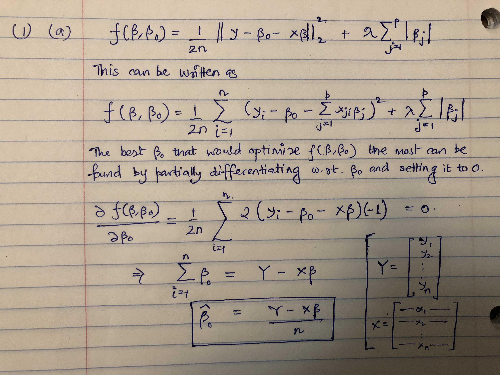

```{r setup, include=FALSE}
knitr::opts_chunk$set(echo = TRUE)
```

**(a)**

```{r echo=FALSE, message=FALSE, warning=FALSE, paged.print=FALSE}

```


The one-variable optimization problem of Beta_0 based on this objective function.

\pagebreak

**(b)**

```{r echo=FALSE, out.height= "1000px", out.width = "400px", message=FALSE, warning=FALSE}
knitr::include_graphics('./1b.jpg')
```

The one-variable optimization problem of Beta_j based on this objective function.