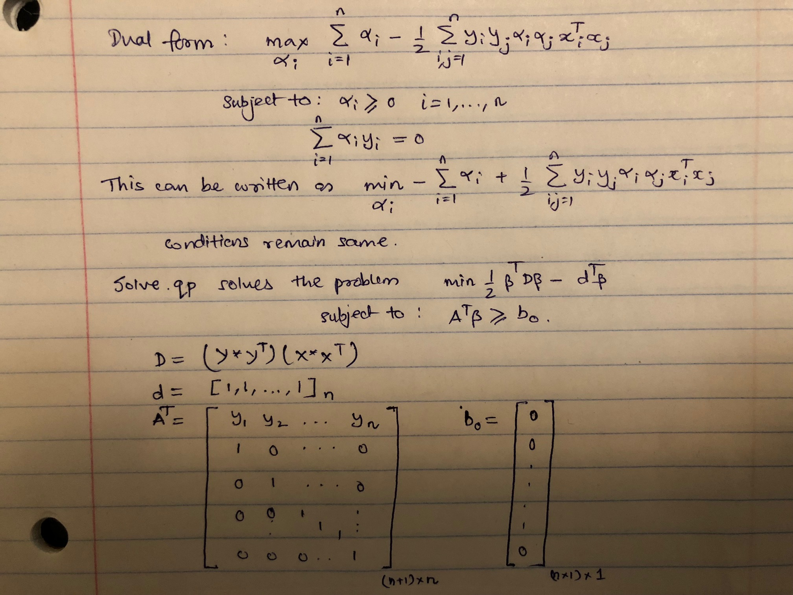
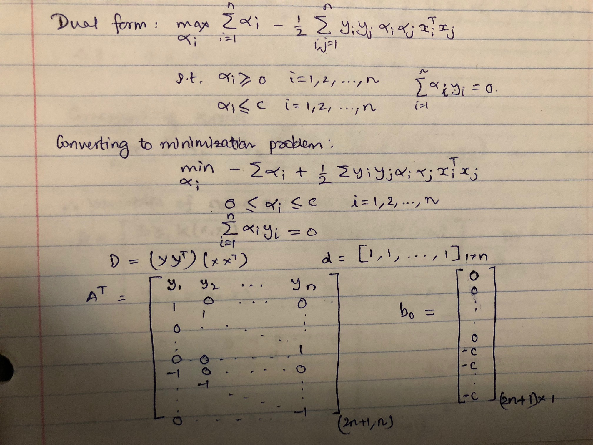
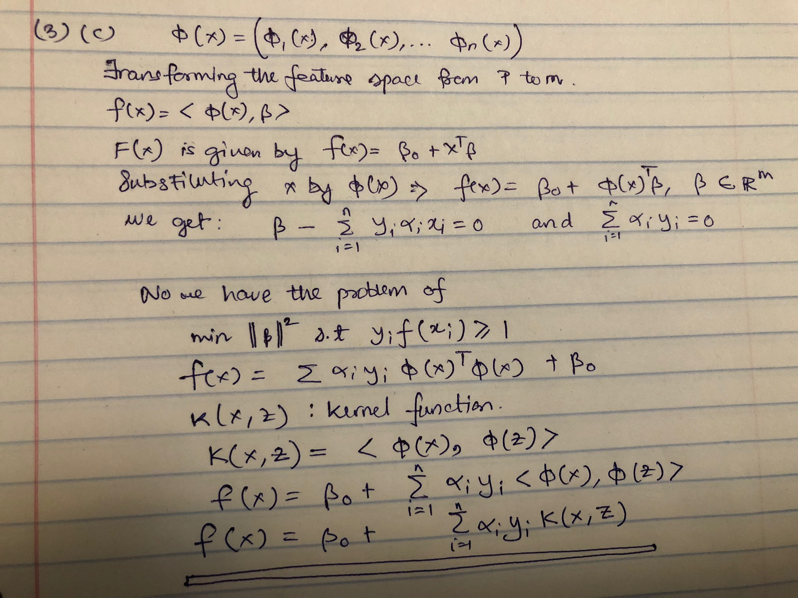
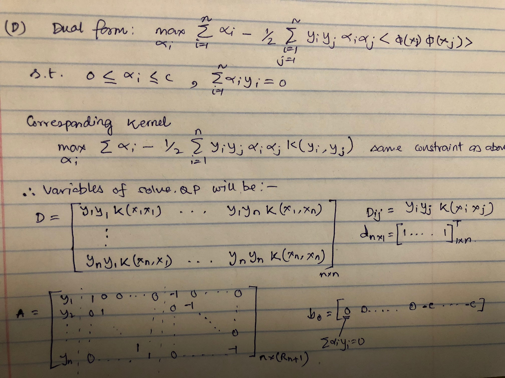

```{r setup, include=FALSE}
knitr::opts_chunk$set(echo = TRUE, warning = FALSE, message = FALSE, fig.pos = 'H')
```

```{r message=FALSE, include=FALSE, paged.print=FALSE}
library(ElemStatLearn)
library(caret)
library(e1071)
library(quadprog)
library(ggplot2)
library(dplyr)
library(MASS)
library(purrr)
```


# Question 1

```{r message=FALSE, include=FALSE, paged.print=FALSE}
# Loading the data
data("zip.test")
data("zip.train")
trn.dig = as.data.frame(zip.train)
tst.dig = as.data.frame(zip.test)
trn.dig = trn.dig[trn.dig$V1 >3,]
tst.dig = tst.dig[tst.dig$V1 >3,]
```


**(a)**

We will fit a *Linear*, *Polynomial* and a *Radial* kernel SVM on our digits data from ElemStatLearn package.

```{r message=FALSE, warning=FALSE, include=FALSE, paged.print=FALSE}

data("zip.test")
data("zip.train")
trn.dig = as.data.frame(zip.train)
tst.dig = as.data.frame(zip.test)
trn.dig = trn.dig[trn.dig$V1 >3,]
tst.dig = tst.dig[tst.dig$V1 >3,]

trainX = trn.dig[,-1]
trainY = as.factor(trn.dig$V1)

set.seed(2)

#factorising the class variable
trn.dig$V1 = as.factor(trn.dig$V1)
tst.dig$V1 = as.factor(tst.dig$V1)

#range of grid values for linear grid
lin_grid = expand.grid(C = c(2 ^ (-12:-5)))

#range of grid value for radial grid
rad_grid = expand.grid(C = c(2 ^ (0:2)), sigma = c(2 ^ (-3:-1)))

cv_5 = trainControl(method = "cv", number = 5)

#svm linear
set.seed(2)
linear_svm = train( V1 ~ ., data = trn.dig, trControl = cv_5, method = "svmLinear",
  tuneGrid = lin_grid)

#polynomial svm
set.seed(2)
svm_polynomial = train(
  V1 ~ .,
  data = trn.dig,
  trControl = cv_5,
  method = "svmPoly")
```


```{r message=FALSE, warning=FALSE, include=FALSE, paged.print=FALSE}
#radial svm
set.seed(2)
svm_radial = train(
  V1 ~ .,
  data = trn.dig,
  trControl = cv_5,
  method = "svmRadial",
  tuneGrid = rad_grid)
```


```{r message=FALSE, warning=FALSE, include=FALSE, paged.print=FALSE}
#some useful functions to calculate accuracy and the fetching the best results for the fitted caret model

#function to calculate accuaracy
calc_acc = function(actual, predicted) {
  mean(actual == predicted)
}

#function to calculate root mean square error
calc_rmse = function(actual, predicted) {
  sqrt(mean((actual - predicted) ^ 2))
}

#function to fetch the best caret model from for different tuning parameters
get_best_result = function(caret_fit) {
  best = which(rownames(caret_fit$results) == rownames(caret_fit$bestTune))
  best_result = caret_fit$results[best, ]
  rownames(best_result) = NULL
  best_result
}

get_best_result(linear_svm)
get_best_result(svm_polynomial)
get_best_result(svm_radial)
```


Five fold cross validation has been used to pick the best model

- Linear Kernel : c = 0.0078125 gives the best training accuracy of 99.07%
- Polynomial Kernel : The model with degree = 2, scale = 0.01 and c = 0.5 gives the best training accuracy of 99.53%
- Radial kernel : The model with sigma = 0.125 and c = 2 gives the best training accuracy of 79.09%


**(b)**

```{r , message=FALSE, warning=FALSE, include=FALSE, paged.print=FALSE}

model_list = list(linear_svm, svm_polynomial, svm_radial)

model_details = sapply(X = model_list, FUN = get_best_result)

models_acc = map_chr(model_details, "Accuracy") %>% as.numeric()

predictions = sapply(X = model_list, FUN = predict, newdata = tst.dig)

test_accuracy = apply(X = predictions, FUN = calc_acc, actual = tst.dig$V1, MARGIN = 2)

model = c("Linear SVM", "Poly SVM", "Radial SVM")
  
Ex1_summary = data.frame("Model_Name" = model, "Test_Accuracy" = test_accuracy)

knitr::kable(Ex1_summary, align = "c", caption = "Performance of different kernel SVM")

```


**(c)**

**Advantages of kernels used:**
  - *Linear:* Faster to train than other kernels. Performs especially well when the seperation boundary is linear. Works very well with multiple features. Performs very well when number of features is large.
  - *Polynomial:* WOrks very well when some polynomial space of the features have a linear seperation boundary. Allows learning of non linear data models. Helps take care of interaction features as well.
  - *Radial:* Performs very well with non linear data, and when number of features is not very high. It can project features space into a higher dimensional feature space.
  
**Disadvantages of kernels used:**
  - *Linear:* Cannot be used if the decision boundary is non linear which is mostly the case in real life data.
  - *Polynomial:* Can be very slow as the degree of the polynomial increases. Can suffer from the problem of numerical instability.
  - *Radial:* Can be very slow and does not perform very well if the number of features in high.


**Is cross-validation effective on this analysis? Is there any potential pitfall that you could think of?**

Cross validation is effective in tuning the best parameter. But one potential pitfall can be the amount of time it takes to build each model and validate each of the many models it has to train.

# Question 2

**(a)** My own linear discriminate analysis (LDA) code gave an accuracy of **0.82** on the test data.

The LDA from the MASS package also gave an accuracy of **0.82** on the test data.


```{r eval=FALSE, message=FALSE, warning=FALSE, include=FALSE}
trn = read.csv("fashion-mnist_train.csv")
tst = read.csv("fashion-mnist_test.csv")

X = trn[, -1]
Y = trn[, 1]
dim(X)

Xtest = tst[, -1]
Ytest = tst[, 1]
dim(Xtest)

misclassification = function(pred, actual)
{
  mean(pred!=actual)
}
```


```{r eval=FALSE, message=FALSE, warning=FALSE, include=FALSE}
P = ncol(X)
N = nrow(X)

# Prior Prob
prior = rep(0, 10)
for(c in unique(Y))
{
  prior[c+1] = nrow(X[which(Y == c), ])/nrow(X)
}
# Mean
mu = matrix(0, length(unique(Y)), ncol(X))
for(c in unique(Y))
{
  XX = X[which(Y == c), ]
  mu[c+1, ] = colMeans(XX) 
}
# Covariance matrix
cov = matrix(0, P, P)
for(c in unique(Y))
{
  XX = X[which(Y == c), ] - mu[c+1, ] # n*P
  cov = cov + t(as.matrix(XX)) %*% as.matrix(XX)
}
cov = cov / (N - 10)
invcov = solve(cov)
# w and b for each class
w = matrix(0, 10, P)
b = matrix(0, 10, 1)
for(c in unique(Y))
{
  w[c+1, ] = mu[c+1, ] %*% invcov
  b[c+1] = -0.5 * w[c+1, ] %*% mu[c+1, ] + log(prior[c+1])
}

res = t(as.matrix(Xtest) %*% t(w))
res = res + b[, 1]
dim(res)


pred = rep(0, ncol(res))
for(i in 1:ncol(res))
{
    pred[i] = which.max(res[, i])-1
}

my.lda.acc = 1-misclassification(pred, Ytest)
print(my.lda.acc)

dig.lda=lda(X,Y)
Ytest.pred=predict(dig.lda, Xtest)$class
table(Ytest, Ytest.pred)
print(1-mean(Ytest != Ytest.pred))
```


**(b)** My own linear discriminate analysis (LDA) code gave an accuracy of **0.835** on the test data with an $\alpha = 0.05$.


```{r eval=FALSE, message=FALSE, warning=FALSE, include=FALSE}
P = ncol(X)
N = nrow(X)

pi_k = matrix(NA, 10, 1)
mu_k = matrix(NA, P, 10)
sigma_k = list()

for(i in 0:9)
{
  ind = which(Y==i)
  XX = X[ind, ]
  pi_k[i+1, 1] = nrow(XX)/N
  mu_k[, i+1] = apply(XX, 2, mean)
  sigma_k[[i+1]] = cov(XX)
}

sigma = Reduce("+", sigma_k)*(N/10 - 1) / (N-P)

alpha = c(0.05)
my.qda.acc = rep(0, length(alpha))

for(k in 1:length(alpha))
{
  Coef = list()
  for(i in 0:9)
  {
    sigma.k = alpha[k]*sigma_k[[i+1]]+(1-alpha[k])*sigma
    inv = solve(sigma.k)
    W_k = -0.5*inv
    w_k = inv%*%mu_k[,i+1]
    d = sum(log(eigen(sigma.k)$values))
    b_k = -0.5*t(mu_k[,i+1])%*%inv%*%mu_k[,i+1] + log(pi_k[i+1]) - 0.5*d
    Coef[[i+1]] = list(W_k, w_k, b_k)
  }
  pred = rep(NA, nrow(Xtest))
    tst_i = as.matrix(Xtest)
    
    res = matrix(NA, nrow(Xtest), 10)
    for(j in 0:9)
    {
      res[, j+1] = as.matrix(rowSums((tst_i%*%Coef[[j+1]][[1]])%*%t(tst_i))) + as.matrix(tst_i%*%Coef[[j+1]][[2]]) 
                        + Coef[[j+1]][[3]]
    }
  
    for(i in 1:nrow(Xtest))
    {
    index = which(res[i, ] == max(res[i, ]))
    pred[i]=index-1
    }
    my.qda.acc[k] = 1-misclassification(pred, Ytest)
}

print(my.qda.acc[k])

```

**(c)** Regularized QDA has an advantage over LDA because in this case we do not need to study the structure of the data in order to decide if we should apply LDA or QDA. It automatically decides the appropriate value of $\alpha$ thus deciding whether a reduction to a particular form (LDA or QDA) is required or not.

QDA is unlikely to produce satisfactory results unless the ratio of the class sample sizes is large relative to the number of variables posed in the problem, and it has no advantages compared to LDA except when the class
covariance matrices are quite different. In situations where the class covariance matrices are similar, LDA
is likely to give improved results compared to QDA, because a single covariance matrix can be employed in the classification rule, thus reducing the number of estimates which need to be computed. LDA should therefore be able to produce better results, when the sample sizes are smaller. 

Regularized QDA always gives results equivalent to or better than LDA and QDA since it automatically decides the appropriate value of $\alpha$ thus deciding whether a reduction to a particular form (LDA or QDA) is required or not. The only downside to Regularized QDA is that it takes a lot of time.


# Question 3


**(a)**

```{r echo=FALSE, fig.cap="Formulation of Dual form", message=FALSE, warning=FALSE, paged.print=FALSE}

```


```{r message=FALSE, warning=FALSE, include=FALSE, paged.print=FALSE}
set.seed(1)
n = 40
p = 2
xpos = matrix(rnorm(n*p ,mean=0,sd=1), n, p)
xneg = matrix(rnorm(n*p ,mean=4,sd=1), n, p)
x = rbind(xpos, xneg)
y = matrix(c(rep(1, n), rep(-1, n)))

ggplot(data=data.frame(x1=x[,1], x2=x[,2], y=y), aes(x=x1, y=x2, color=as.factor(y))) +
  geom_point()
```


```{r echo=FALSE, message=FALSE, warning=FALSE, paged.print=FALSE}
G = (y %*% t(y))*(x %*% t(x))
diag(G) = diag(G) + 1e-5

f = rep(1, n*2)

A1 = t(y)
A2 = diag(n*2)
A = rbind(A1, A2)

b = rep(0, n*2 + 1)

best = solve.QP(Dmat = G, dvec = f, Amat = t(A), bvec = b, meq = 1)


beta = t(best$solution * y) %*% x
sv_ind = which(best$solution > 0)
sv_x = x[sv_ind, ]
sv_y = y[sv_ind]
z = sv_x %*% t(beta)
beta0 = -(max(z[which(sv_y==-1)]) + min(z[which(sv_y==1)]))/2
print("Coefficients from my SVM")
print(paste0("Beta0 = ", beta0, "  Beta values = ", beta[1], ", ", beta[2]))
```


```{r echo=FALSE, message=FALSE, warning=FALSE, paged.print=FALSE}
svm_e = svm(x=x, y=as.factor(y), method = "C-classification", scale = FALSE, kernel = 'linear')
w = t(svm_e$coefs) %*% svm_e$SV
b0 = -svm_e$rho
print("Coefficients from package SVM")
print(paste0("Beta0 = ", b0, "  Beta values = ", w[1], ", ", w[2]))
```


```{r echo=FALSE, message=FALSE, warning=FALSE, paged.print=FALSE, fig.cap="Comparison plot of my svm vs package. Blue:SVM Package, Black: My LDA"}
plot(x = x[,1], y = x[,2], col = as.factor(y), pch = 19, xlab = "x1", ylab = "x2")
abline(a = -(beta0-1)/beta[2], b = -(beta[1])/beta[2], lty = 3, lwd = 2)
abline(a = -(beta0+1)/beta[2], b = -(beta[1])/beta[2], lty = 3, lwd = 2)
abline(a = -beta0/beta[2], b = -beta[1]/beta[2], lty = 1, lwd = 2)
abline(a = -b0/w[2], b = -w[1]/w[2], lty = 4, lwd = 1, col = "blue")
```


**(b)**


```{r echo=FALSE, message=FALSE, warning=FALSE, paged.print=FALSE, fig.cap="Formulation of dual form"}

```

```{r message=FALSE, warning=FALSE, include=FALSE, paged.print=FALSE}
set.seed(1)
n = 40
p = 2
xpos = matrix(rnorm(n*p ,mean=0,sd=1), n, p)
xneg = matrix(rnorm(n*p ,mean=1.8,sd=1), n, p)
x = rbind(xpos, xneg)
y = matrix(c(rep(1, n), rep(-1, n)))


G = (y %*% t(y))*(x %*% t(x))
diag(G) = diag(G) + 1e-5

f = rep(1, n*2)

A1 = t(y)
A2 = diag(n*2)
A3 = -diag(n*2)
A = rbind(A1, A2, A3)

C = 10
b = c(rep(0, n*2 + 1), rep(-C, n*2))


best = solve.QP(Dmat = G, dvec = f, Amat = t(A), bvec = b, meq = 1)


beta = t(best$solution * y) %*% x
sv_ind = which(best$solution > 0)
sv_x = x[sv_ind, ]
sv_y = y[sv_ind]
z = sv_x %*% t(beta)
beta0 = -(max(z[which(sv_y==-1)]) + min(z[which(sv_y==1)]))/2

svm_e = svm(x=x, y=as.factor(y), method = "C-classification", scale = FALSE, kernel = 'linear', cost = 10)
w = t(svm_e$coefs) %*% svm_e$SV
b0 = -svm_e$rho

```


Plot showing decision boundary we got from my SVM with that we get from the package

```{r echo=FALSE, fig.cap="Comparison plot of my svm vs package. Blue:SVM Package, Black: My Regularized QDA"}
plot(x = x[,1], y = x[,2], col = as.factor(y), pch = 19, xlab = "x1", ylab = "x2")
abline(a = -(beta0-1)/beta[2], b = -beta[1]/beta[2], lty = 3, lwd = 2)
abline(a = -(beta0+1)/beta[2], b = -beta[1]/beta[2], lty = 3, lwd = 2)
abline(a = -beta0/beta[2], b = -beta[1]/beta[2], lty = 1, lwd = 2)
abline(a = -b0/w[2], b = -w[1]/w[2], lty = 4, lwd = 2, col = "blue")
```


**(c)**

```{r echo=FALSE, message=FALSE, warning=FALSE, paged.print=FALSE, fig.cap="Formulation of new decision function"}

```


**(d)**

```{r echo=FALSE, message=FALSE, warning=FALSE, paged.print=FALSE, fig.cap="Formulation of dual problem"}

```

